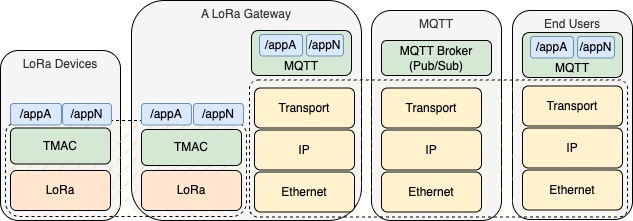
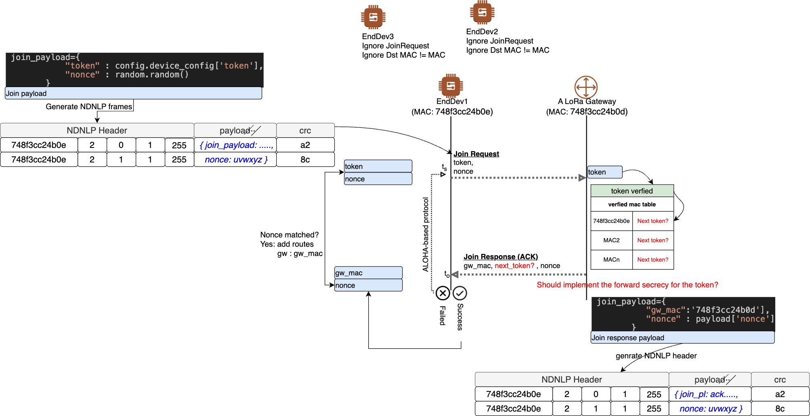
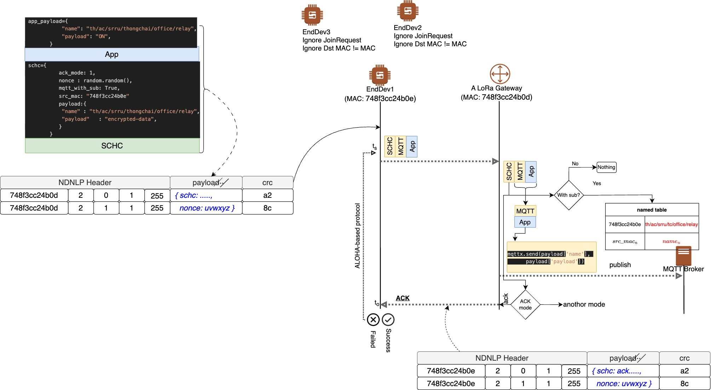
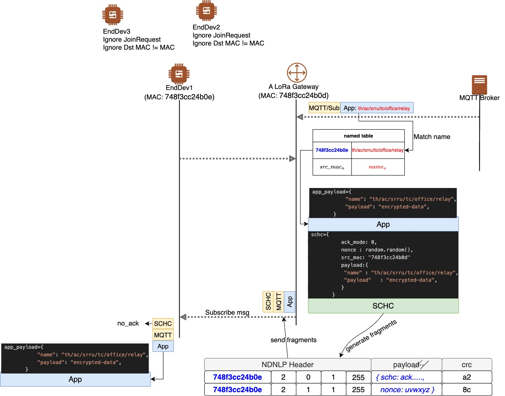

# TMAC: A Telemetry MAC Protocol for MQTT over LoRa Networks
      ^^ 
     (oo) 
    /(__)\
     TMAC    
 
MQ Telemetry Transport (MQTT) has been designed and developed for an ultra-low bandwidth communication and has been applied to used in Internet of Things (IoT). Recently, MQTT has been used in traditional TCP/IP networks. Yet, the ultra-low bandwidth and long-range communication of MQTT have been considerably increased. Previous proposed techniques still struggle to make MQTT compatible with Long-Range (LoRa) networks. In this paper, we have design and implement the Telemetry Media Access Control (TMAC). Our TMAC helps increase ranges of MQTT’s data communications. We have experimented our TMAC using a network testbed. Experimental results have illustrated that our TMAC can transfer data over 5 kilometers with low network overhead.

# Apps Pub/Sub over LoRa Networks

This image show a network architecture, and ensures seamless data transmission from LoRa-enabled devices to end applications using MQTT as the communication protocol.

# Fragmentation/Reassembly 
The original concept of F/R was adapted from [NDNLP](https://named-data.net/techreport/TR006-LinkProtocol.pdf)  to LoRa. TMAC also utilizes an ALOHA-based protocol to recover from unsuccessful LoRa frame transmissions.

# Join

For a TMAC network join, an end IoT device composes a join payload and broadcasts it to the LoRa network. All other devices, except the gateway, ignore the join message. The gateway receives and verifies the received token, adding it to a verified MAC table that contains allowed MAC addresses. The gateway then generats a join response payload, with the received nonce, to response a specific mac.
- TODO: The forward secrecy should be incorporated, ensuring that past communications remain secure even if future keys are compromised.

# Publish

To publish an MQTT message over LoRa networks, an end IoT device must include a name and the encrypted data in the MQTT payload. The SCHC header is utilized to manage the MQTT payload at the LoRa gateway. If mqtt_with_sub is present in the JSON header, the name and MAC address of the end IoT device are added to the named table. The gateway then publishes the name to the MQTT broker.

# Subscribe 

For a subscribe message from the MQTT broker, the gateway retrieves the corresponding MAC address from the named table to provide the NDNLP header. The SCHC header model then constructs and incorporates the MQTT payload into a packet. The gateway subsequently generates NDNLP fragments and transmits them to the destination MAC address.

# TODO
  - To support WebSocket 

# License
MIT License

Copyright (c) 2025 Thongchai Chuachan

Permission is hereby granted, free of charge, to any person obtaining a copy of this software and associated documentation files (the “Software”), to deal in the Software without restriction, including without limitation the rights to use, copy, modify, merge, publish, distribute, sublicense, and/or sell copies of the Software, and to permit persons to whom the Software is furnished to do so, subject to the following conditions:

The above copyright notice and this permission notice shall be included in all copies or substantial portions of the Software.

THE SOFTWARE IS PROVIDED “AS IS”, WITHOUT WARRANTY OF ANY KIND, EXPRESS OR IMPLIED, INCLUDING BUT NOT LIMITED TO THE WARRANTIES OF MERCHANTABILITY, FITNESS FOR A PARTICULAR PURPOSE AND NONINFRINGEMENT. IN NO EVENT SHALL THE AUTHORS OR COPYRIGHT HOLDERS BE LIABLE FOR ANY CLAIM, DAMAGES OR OTHER LIABILITY, WHETHER IN AN ACTION OF CONTRACT, TORT OR OTHERWISE, ARISING FROM, OUT OF OR IN CONNECTION WITH THE SOFTWARE OR THE USE OR OTHER DEALINGS IN THE SOFTWARE.

# Citation
Thongchai Chuachan, Taweewat Moonjat, Aktanat Luengsiriwan. "TMAC: A Telemetry MAC Protocol for MQTT over LoRa Networks".  Science and Technology Journal Mahasarakham University, 42:4 pp.108-117, 2023.

Download => https://li01.tci-thaijo.org/index.php/scimsujournal/article/view/256865/176669 
